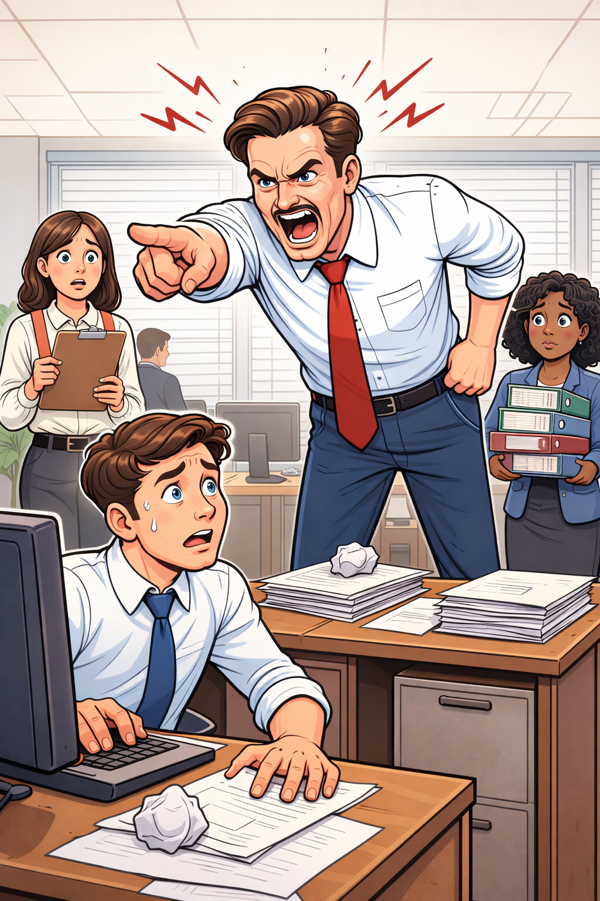
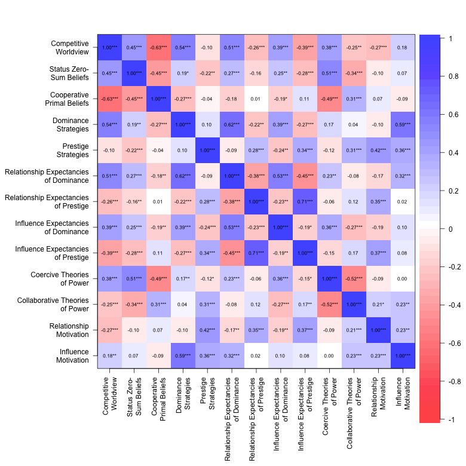
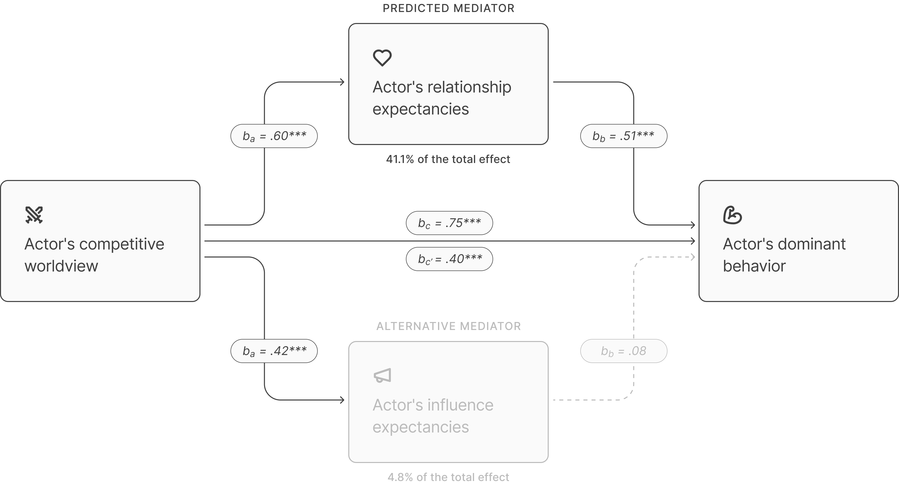
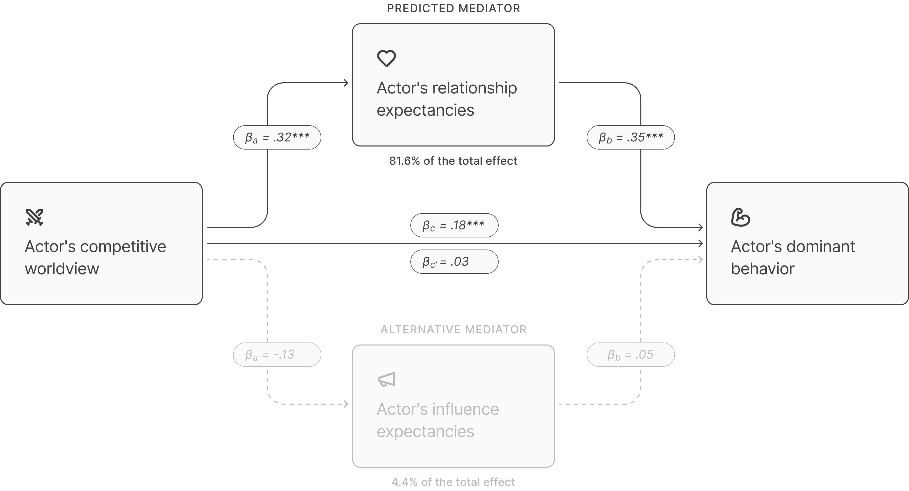
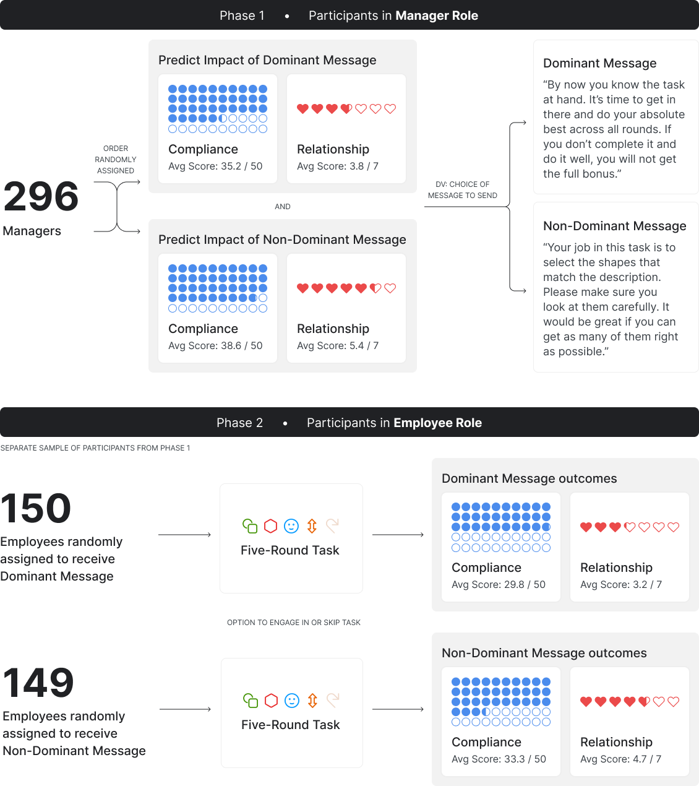
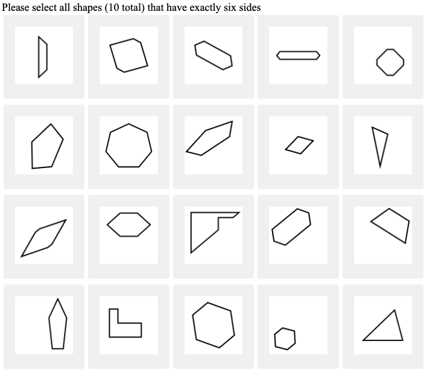
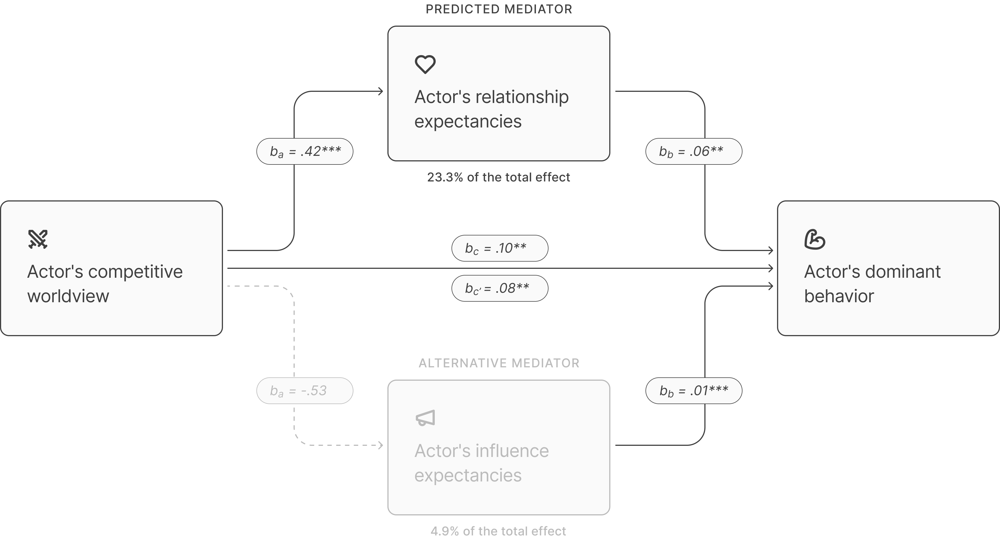
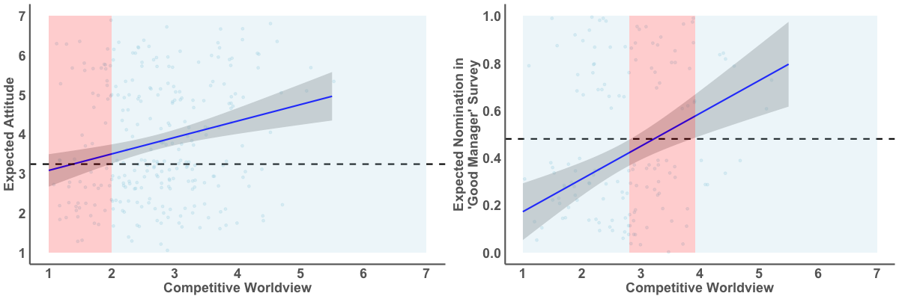

# Problem

  

Managers sometimes behave **dominantly** toward employees, using threats, coercion, or an aggressive tone in an attempt to exert influence. In many cases, this behavior is not intended to harm relationships. Rather, it reflects an instrumental choice: dominance is used because it is believed to be effective.

Yet dominant behavior can carry **relationship costs**, including reduced trust, liking, and respect. Despite these risks, managers vary widely in their willingness to use dominance. This raises a practical question for organizations: **why do some managers rely on dominant tactics, even when it may lead to strenuous relationships between them and their employees?**

I propose that managers’ **beliefs** about the relational impact of dominance matter. Many managers who behave dominantly do **not** discount relationship outcomes and do **not** intend to cause relational harm. Instead, they operate under a **belief-based blind spot**: they underestimate the extent to which dominance harms relationships, believing it may be effective *without* being especially costly to the relationship.

I distinguish between three potential drivers of dominant behavior:

1. **Influence expectancies**: beliefs about whether dominance will increase *compliance*.
2. **Relationship motivations**: the extent to which managers *care* about their relationships with employees.
3. **Relationship expectancies**: beliefs about the *relationship impact* of dominant behavior.

These situation-specific beliefs do not operate in a vacuum. I trace relationship expectancies back to a broader social mental model: **competitive worldview**—the belief that the social world is a constant battle for status and resources. Managers with a competitive worldview are more likely to view dominance as **normal, acceptable, and unobjectionable**, and therefore to expect limited relationship harm. In turn, these expectations increase the likelihood that they will behave dominantly.

  

  

# Executive summary

Managers often use dominant tactics (threats, coercion, aggressive tone) because they believe it’s effective. In this case study, I show that dominant behavior is less about wanting to harm relationships—or even prioritizing compliance at all costs—and more about a belief-based blind spot: some managers systematically misjudge the relationship cost of dominance.

Across four studies, I identify a consistent mechanism:

  - Competitive worldview (seeing the social world as a constant battle for status and resources) predicts greater reliance on dominant leadership strategies.
  - The key pathway is relationship expectancies: managers high in competitive worldview expect dominance to carry limited relationship harm, and those beliefs increase dominant behavior.
  - This mechanism holds:
    - in a survey with extensive competing predictors controlled (Study 1);
    - in reactions to real employee descriptions of dominance (Study 2);
    - in an incentive-compatible manager–employee role-play with real financial stakes (Study 3);
    - and in a causal experiment where shifting relationship expectancies changes dominant behavior (Study 4).

Most importantly for practitioners: **relationship expectancies are a measurable, movable lever**. Interventions can succeed by **revealing a relational blind spot**, rather than attempting to reshape motivations, worldviews, or incentive systems.

# Evidence strategy

**Finding the unique roles of relationship expectancies and competitive worldview in predicting dominance**

The first challenge is separating beliefs about the **relationship impact of dominance**, and the broader **competitive worldview**, from alternative predictors of dominant behavior. In **Study 1**, I use well-established measures and multilevel modeling to test whether relationship expectancies drive dominant strategies at work, whether competitive worldview informs these beliefs, and whether these effects hold above and beyond influence expectancies, relationship motivations, and related mental models.

**Grounding the model in real workplace experiences**

A second challenge is whether these patterns hold beyond abstract self-report measures. In **Study 2**, I ground dominance in real workplace experience by collecting employee descriptions of actual managerial dominance and examining how others forecast its relationship impact and their own willingness to behave dominantly in the same situations.

**Observing dominant behavior under incentives**

A third challenge is whether stated intentions reflect how managers behave when real outcomes are at stake. In **Study 3**, I observe dominant behavior directly using an incentive-compatible manager–employee role-play, allowing me to test whether relationship expectancies predict actual dominance (even at the potential cost of financial loss) and whether dominant managers *underestimate* relationship harm or non-dominant managers *overestimate* it.

**Establishing a causal effect**

Finally, correlational evidence cannot fully establish whether relationship expectancies *lead to* dominant behavior. I address this in a separate experiment that directly manipulates relationship expectancies and measures subsequent dominance choices, described in a companion A/B testing report (see LINK).

# Study 1: The unique roles of relationship expectancies and competitive worldview

  

    <a href="https://deanbaltiansky.com/dominance-in-the-competitive-jungle/studies/study-1/index.html" target="_blank" rel="noopener"
       style="background:#0b69ff;color:white;padding:0.55em 0.9em;border-radius:8px;text-decoration:none;display:inline-block;margin:0;">
      FULL REPORT ↗
    </a>
  

## Procedure

I conducted a survey of **275 full- and part-time employees** to isolate the beliefs that predict dominant leadership strategies at work. 

The core variables were:

  - **Competitive worldview:** The belief that the social world is a constant battle for status and resources.
  - **Dominant leadership strategies:** Self-reported use of coercive and threatening tactics to gain and maintain influence at work.
  - **Expected consequences of dominance:** For each dominant behavior and strategy, participants rated its:
    - **Relationship impact:** *Extremely negative* to *extremely positive* impact on relationships with others;
    - **Influence impact:** *Extremely negative* to *extremely positive* impact on influence over others.

This design allowed me to test whether the effect of competitive worldview on dominance is driven by *relationship expectancies* over and above *influence expectancies*.

To rule out alternative explanations, I measured and statistically controlled for a comprehensive set of competing predictors:

   - **Status zero-sum beliefs:** The belief that for one person to gain status, others have to lose.
   - **Cooperative primal beliefs:** The belief that people are inherently cooperative.
   - **Coercive theories of power:** The belief that people rise to power through coercion and intimidation.
   - **Collaborative theories of power:** The belief that people rise to power through empathy and respect.
   - **Relationship motivations at work:** The extent someone cares about having good relationships at work.
   - **Demographic factors:** Race, gender, age, income, and education.

This approach isolates the unique predictive contribution of competitive worldview and relationship expectancies to dominant leadership behavior at work, over and above plausible alternative explanations.

## Correlations

I first examine descriptive correlations among the core variables. Competitive worldview, relationship expectancies of dominance, and dominant leadership strategies are strongly correlated (*r*s = .51 *to* .62). These associations establish basic co-variation, providing **initial support** for the hypothesized relationships, but they do not indicate which beliefs **uniquely** drive dominance. The multivariate analyses below address this. 

  

    <a href="https://deanbaltiansky.com/dominance-in-the-competitive-jungle/studies/study-1/app/index.html" target="_blank" rel="noopener"
       style="background:#0b69ff;color:white;padding:0.55em 0.9em;border-radius:8px;text-decoration:none;display:inline-block;margin:0;">
      INTERACTIVE CORRELATIONS EXPLORER ↗
    </a>
  

## Explaining the effect of competitive worldview on dominance

To isolate the **unique contribution** of competitive worldview and **identify the pathway** through which it predicts dominant strategies at work, I conducted a **simultaneous mediation model** with 10,000 bootstrap samples.

The model includes two competing mechanisms:

  - **Relationship expectancies of dominance** and
  - **Influence expectancies of dominance**.

I entered them into the model simultaneously, statistically adjusting for a comprehensive set of alternative explanations, including zero-sum beliefs, cooperative primal beliefs, relationship motivations, theories of power, and demographic factors.

### Step 1: Competitive worldview uniquely predicts dominance

Controlling for all alternative predictors, **competitive worldview remains a strong predictor of dominant strategies** (*b* = .75, *t*(254) = 8.85, 95% CI = [0.58, 0.91], p < .001). This indicates that competitive worldview contributes unique explanatory signal to dominance, over and above alternative predictors.

### Step 2: Competitive worldview predicts lower anticipated relationship cost

Additionally, controlling for the same mental models and demographics, **competitive worldview strongly predicts relationship expectancies of dominance**, such that those with a competitive competitive worldview anticipate **less relationship harm** from dominant behavior (*b* = .60, *t*(254) = 8.85, 95% CI = [0.47, 0.73], *p* < .001).

  

    <a href="https://deanbaltiansky.com/dominance-in-the-competitive-jungle/studies/study-1/lm-table-app/index.html" target="_blank" rel="noopener"
       style="background:#0b69ff;color:white;padding:0.55em 0.9em;border-radius:8px;text-decoration:none;display:inline-block;margin:0;">
      EXPLORE LINEAR MODELS ↗
    </a>
  

### Step 3: Relationship expectancies explain the effect

<!--html_preserve-->

  <!-- LEFT: Text (30%) -->
  

    

      To test which beliefs explain the link between competitive worldview and dominance,
      I entered <strong>relationship</strong> and <strong>influence</strong> expectancies
      as simultaneous mediators.
    

    <ul>
      <li><strong>Relationship expectancies account for 41.1%</strong> of the total effect</li>
      <li><strong>Influence expectancies account for only 4.8%</strong></li>
    </ul>

    

      This indicates that dominance is driven primarily by predicted
      <strong>relationship</strong> harm from dominance,
      rather than its predicted impact on <strong>influence</strong>.
    

  

  <!-- RIGHT: Figure (70%) -->
  

    
  

<!--/html_preserve-->

  

    <a href="https://deanbaltiansky.com/dominance-in-the-competitive-jungle/studies/study-1/mediation-app/index.html" target="_blank" rel="noopener"
       style="background:#0b69ff;color:white;padding:0.55em 0.9em;border-radius:8px;text-decoration:none;display:inline-block;margin:0;">
      TEST OTHER MEDIATION MODELS ↗
    </a>
  

Together, these results show that competitive worldview predicts dominance strategies at work by **informing beliefs about the relational consequences of dominance**, rather than expectations of influence. This pattern holds after accounting for a broad set of alternative mental models and demographics, but also, importantly, the extent to which one **cares about relationships** at all. This suggests that relationship expectancies capture a distinct and consequential belief underlying dominant behavior.

However, Study 1 relies on structured self-report measures and abstract descriptions of workplace behavior. While this approach is well suited for isolating predictive signal, it leaves open the question of whether the same patterns emerge in employees’ descriptions of real-world managerial dominance.

# Study 2: Qualitative descriptions of managerial dominance

  

    <a href="https://deanbaltiansky.com/dominance-in-the-competitive-jungle/studies/study-2/index.html" target="_blank" rel="noopener"
       style="background:#0b69ff;color:white;padding:0.55em 0.9em;border-radius:8px;text-decoration:none;display:inline-block;margin:0;">
      FULL REPORT ↗
    </a>
  

## Descriptions of dominance

To evaluate whether the patterns identified in Study 1 generalize beyond abstract survey measures, Study 2 grounds dominance in employees’ lived workplace experiences. I asked employees to describe a concrete instance in which their manager behaved dominantly in an effort to exert influence.

These open-ended descriptions provide a complementary test of the model by capturing how dominance is experienced, interpreted, and evaluated in real organizational contexts. Below are 23 anonymized descriptions of managerial dominance, shared with full consent.

  <table style="width:100%; border-collapse:collapse;">
    <thead>
      <tr>
        <th style="
          position: sticky;
          top: 0;
          z-index: 2;
          background: white;
          text-align: left;
          border-bottom: 1px solid #ddd;
          box-shadow: 0 2px 0 #ddd;
          padding: 6px;
        ">
          Description
        </th>
      </tr>
    </thead>
    <tbody>
      <tr>
        <td style="padding:6px 6px 12px 6px;">
          I work as an Ecommerce Specialist for a Fabric company that is expanding their virtual presence. As such, I make many nuance and minor decisions about the visual layout as well as the descriptions and images used for items/listings. All of these add up to a much bigger picture to increase sales and revenue. My manager was trying to get me to use hand-made and uploaded images for each listing, versus finding the manufacturing made or other second hand made images. This would be far more time consuming and would hurt our ability to streamline. The manager basically demanded that I did so, and told me that it was an order, and that they will hire someone to produce those images and provide them too me. They weren't too loud, but they were forceful.
        </td>
      </tr>
      <tr>
        <td style="padding:6px 6px 12px 6px;">
          I was up for a promotion at work, and for context should add I was also 34 weeks pregnant. We were working to debut a product our engineering team had been working on. My manager was trying to get me to fly cross country to present our product to the board. They didn't ask if I wanted to go, and they knew I wasn't allowed to fly because of my pregnancy and said if I involved HR I would be sorry.
        </td>
      </tr>
      <tr>
        <td style="padding:6px 6px 12px 6px;">
          I work at a school, and I work with my supervisor in the Spring to coordinate testing. Well, my elderly Mom had a doctors appointment for one of those days, and I asked for it off to be with her, thinking that she would be ok on her own for one day. She flew into a rage and yelled at me so much that spit got on my face. She intimidated me into not taking that day off and to reschedule Mom's appointment.
        </td>
      </tr>
      <tr>
        <td style="padding:6px 6px 12px 6px;">
          I am a worker at a retirement home and for some reason there is a chair in a person's bathroom which I sit sometimes to take a short break. My boss saw me one time, marched me to her office and had a chat with me, telling me I can't do that. I said very little and got out of there as soon as I could.
        </td>
      </tr>
      <tr>
        <td style="padding:6px 6px 12px 6px;">
          I work as a librarian, my manager wanted me to spearhead a project for a new children's exhibit. I was very busy working on other projects for another manager and told her this. I found out they were the ones put in charge of the exhibit and were trying to foist it onto me. She threatened to revoke my already established days off.
        </td>
      </tr>
      <tr>
        <td style="padding:6px 6px 12px 6px;">
          I am a lab manager for a forensics lab. My manager wanted me to have the lab accredited through a national accreditation agency. He ordered me to do an enormous amount of documentation, research, and other work knowing I wouldn't be compensated for the additional work, and he told me he simply didn't care how many extra hours I had to put into it. He was stern and rude about it.
        </td>
      </tr>
      <tr>
        <td style="padding:6px 6px 12px 6px;">
          I worked at a small business gift shop owned by a local man. One winter, he was annoyed that sales were low. He told me unless I started to sell more, he wouldn't reimburse me for my Uber rides home anymore. He thought by threatening me, I would become a better salesperson.
        </td>
      </tr>
      <tr>
        <td style="padding:6px 6px 12px 6px;">
          I worked at Bath and Body Works. Our manager at the time wanted us to give everyone that walked in a hand massage with the lotion. I don't like touching random people so I wasn't doing it. She pulled me to the back and sternly let me know she wasn't happy with me not doing it.
        </td>
      </tr>
      <tr>
        <td style="padding:6px 6px 12px 6px;">
          My manager was trying to get me to file paperwork at a court that I knew was not correct. He was very insecure with himself and his role as manager and wanted to show me that he was boss and I had to do what he wanted. Even though I was just a paralegal, I knew the correct information that needed to be included in the court document before it was filed with the court. I brought this point up to my manager and he basically told me I didn't know what I was talking about and that I just needed to do as he asked. He called me into his office and told me sternly my job was to do his work as he requested. I was very hesitant and didn't know what to do because I knew if I filed the paperwork as is, it would be rejected by the court.
        </td>
      </tr>
      <tr>
        <td style="padding:6px 6px 12px 6px;">
          I work in accounting and my supervisor oversees just our sector of accounting, not all of accounting for the whole company. I tend to be more savvy in the accounting software than the rest of my team including my manager. I will find more efficient ways to complete reports or tasks. I will share these findings in my group's Teams chat. My boss will often speak down to me or try and pinhole my solutions on Teams. She speaks to me like a child and will say things like "did I tell you to find a new way to do this or did I ask you to run the report as we always do?" or "Is there a reason you did xyz when the rest of us are ok with doing abc like I ask?"
        </td>
      </tr>
      <tr>
        <td style="padding:6px 6px 12px 6px;">
          It was a project which was awarded to my manager, he couldn't keep up with the project and then asked for my help in the project completion. While in the process of the getting the project done, my method of getting the work done was different from his and it was getting noticeable. He began asserting dominance stating the project was his and things needs to be done his way and I was only trying to be on the spotlight by using my method.
        </td>
      </tr>
      <tr>
        <td style="padding:6px 6px 12px 6px;">
          I was working as a cashier at a grocery store. I was tasked with asking customers to donate to a children’s charity. That day, many customers declined to donate. The manager, who was responsible for running the store, called me to the back room and immediately accused me of not doing my job. He used a tone that was accusatory and bossy, stating that I was not asking for donations. He wanted me to obtain more donations so the store could beat others in the competition to raise the most funds.
        </td>
      </tr>
      <tr>
        <td style="padding:6px 6px 12px 6px;">
          My current manager told me, when I was first hired, that I completed my cleaning of the rooms too slow. She wanted me to go faster, so she reminded me that there were many people that were faster than me and if I kept performing the way I was performing she would let me go.
        </td>
      </tr>
      <tr>
        <td style="padding:6px 6px 12px 6px;">
          I was working at a commerical bank a couple of years ago, and my acting director, who was my de facto line manager, became very unappy when he found out that I was responding to the CFO regarding an issue that the CFO had emailed me directly about. This led to a very heated argument where he accused me of not respecting hierarchy and authority, and he began yelling and shouting and throwing things around.
        </td>
      </tr>
      <tr>
        <td style="padding:6px 6px 12px 6px;">
          My manager was determined to revamp our company's social media strategy to increase sales, engagement and brand visibility. Her dominant behavior manifested in various ways throughout the process. First, she held a high-pressure meeting where she outlined her vision with unwavering confidence, leaving little room for dissent. Her tone was authoritative, and her body language exuded a sense of control, effectively conveying her expectations to the team.
        </td>
      </tr>
      <tr>
        <td style="padding:6px 6px 12px 6px;">
          There was a job that needed to be attempted the way that the company wanted it to be accomplished by following a set of instructions that were left by the client. The supervisor made sure we worked on teams and watched everyone including myself like an owl because he wanted it done as instructed. The supervisor was very demanding with the job and at times made it unbearable to do our job.
        </td>
      </tr>
      <tr>
        <td style="padding:6px 6px 12px 6px;">
          Several years back I was working at a gym. There's usually 3-4 of us at the front desk answering calls, signing people up for membership, giving tours, and answering general questions/concerns people may have. There's also generally one person designated to janitorial duty/cleaning at all times. The janitor duty wasn't mine, but occasionally we did help with cleaning tasks. On this day, no different than any other day, I was briefly chatting with a friend at the gym in sight of the front desk. My manger at the time realised this and yelled at me to go clean something. I put an emphasis on yelled because it was definitely not common and primarily due to that fact was talking to a friend. I said okay and continued talking to close the convo. After about a min. or two, he yelled again. So this time, I immediately closed the convo with my friend, kind of looking at each other with a slight grin realising the power trip going on.
        </td>
      </tr>
      <tr>
        <td style="padding:6px 6px 12px 6px;">
          I work as a nurse in a healthcare facility taking care of patient needs is my role.my manager is my nurse in charge and oversees my roles and allocates duties if necessary.He one day asked me to take up my colleague's duties as i was signing out. he did it forcefully without considering my plans and state of fatigue.
        </td>
      </tr>
      <tr>
        <td style="padding:6px 6px 12px 6px;">
          My role is working in disease control for state government and my boss is the program manager. We work in tuberculosis control and treat patients and try to keep the disease from spreading. She also sees patients but works more administratively usually and as a point of contact. I had recently come back from vacation and a few weeks later, my boss said my focus at work seems off in general and wrote a list with a few examples of things she had seen. She told me she is not a micromanager but can be toward me if needed and that if I can't find something to do, she can always find plenty, that my work quality reflects on her and that I'm not to make her look bad.
        </td>
      </tr>
      <tr>
        <td style="padding:6px 6px 12px 6px;">
          I worked as a Program Manager for a large customer. My manager was a Director at our company. He invited himself to a customer meeting that had been scheduled in another city. He wanted to review the customer and our operations. My team met him at a hotel before meeting with the customer. The customer environment was business casual, so my team dressed for that. In fact, business casual dress was common for all customer engagements. My manager did not approve. He strongly demanded that the entire team wear formal suits, ties and/or dresses for any and all customer visits. He was verbally abusive about the situation. Next, he noticed that some of the hotel rooms we were staying in during the customer visit were more expensive than others. He demanded that only senior-level employees be allowed to stay in the more expensive rooms, and actually made us change our reservations.
        </td>
      </tr>
      <tr>
        <td style="padding:6px 6px 12px 6px;">
          I had a manager that was very dominant when I worked in a warehouse. We would take frozen prepared food and load pallets and trucks. He would constantly threaten to let us go if we did not do things fast enough for his liking and would constantly use fear of our job security to get his way right away. One day at work I had the flu and working the freezer and he was constantly badgering me for being so slow that day. I tried to use a sick day but he refused to let me take sick time saying he we was short staffed. So I was really sick working in a freezer and getting constantly badered by this manager.
        </td>
      </tr>
      <tr>
        <td style="padding:6px 6px 12px 6px;">
          I work as a delivery driver and one of my responsibility is to see that the vehicle is washed in the evening of the day or after the day's work. There are few days that I couldn't take the vehicle to the washing station due to lateness and time factor. This lateness is mainly caused by people in the itinerary department or sometimes delay from customers. Whenever my boss sees the condition of the vehicle the following morning, he verbally attacks me and threatens me with letter of queries. He would insist that I get the vehicle washed myself on the spot. He would always try to absolve the guys in the itinerary of any blame and put all blames on me. He would always insist that the vehicle must always be in pristine condition irrespective of any lateness or lapses from other people.
        </td>
      </tr>
      <tr>
        <td style="padding:6px 6px 12px 6px;">
          I work as a software test engineer and my manager was trying to make me sign off on the latest module we implemented. There was a lot of pieces to test and I was not given enough time, because the development team did not finish on time. My manager was contacting me multiple times every day if I was finished. He would just repeat the same sentences, he said we really needed to finish the tests and hand it over, otherwise it would be a huge problem with the release.
        </td>
      </tr>
    </tbody>
  </table>

## Reactions to descriptions

To test whether the model identified in Study 1 generalizes to **concrete workplace situations**, I recruited a second sample of 289 participants. Each participant was shown one randomly selected description of managerial dominance and asked to react to it.

Specifically, participants reported:

  - The expected impact of the manager’s behavior on the **manager–employee relationship** (*Extremely negative* to *Extremely positive*);
  - The expected impact of the manager's behavior on **employee compliance with the task** (*Not at all* to *Completely*); and
  - How likely they would be to **behave dominantly** (like the manager) if they were in the manager’s position (*Not at all likely* to *Extremely likely*).

Together with a measure of participants’ **competitive worldview**, these reactions provide a test of the model under conditions that more closely resemble **how employees encounter and interpret dominance in practice**.

## Results

For the primary analyses, I conducted **random-effects models** with scenario treated as a random effect. This approach holds constant residual differences between descriptions and focuses inference on **within-scenario variation** in how people interpret and respond to the same dominant behavior.

Competitive worldview significantly predicted participants’ willingness to behave dominantly in the described situation ($\hat{\beta}$ = 0.18, 95% CI = [0.05, 0.31], *p* = .008).

In addition, participants with a more competitive worldview were more likely to perceive the manager’s dominant behavior as having a positive relationship impact, rather than relational harm ($\hat{\beta}$ = 0.32, 95% CI = [0.18, 0.45], *p* < .001).

<!--html_preserve-->

  <!-- LEFT: Text (30%) -->
  

    

      To directly compare the two competing explanations, I conducted a bootstrapped random-effects mediation model, clustered by scenario, with relationship expectancies and compliance expectancies entered as simultaneous mediators.
    

    <ul>
      <li><strong>81.6% of the total effect was explained by relationship expectancies</strong> (beta = 0.11, 95% CI = [0.05, 0.17], p = .001)</li>
      <li>By contrast, compliance expectancies <strong>did not explain</strong> a meaningful portion of the effect (beta = −0.01, 95% CI = [−0.03, 0.02], p = .579)</li>
    </ul>

    

      This provides further evidence, with descriptions of real-world managerial dominance, that the effect of competitive worldview on behavioral intentions of dominance is primarily explained by <strong>relationship, rather than compliance, expectancies</strong>.
    

  

  <!-- RIGHT: Figure (70%) -->
  

    
  

<!--/html_preserve-->

Together, Study 2 demonstrates that the patterns identified in abstract survey measures extend to **reactions to real managerial behavior** from the employee's perspective. When people encounter **concrete instances of dominance**, competitive worldview predicts both a greater willingness to behave dominantly and a systematic tendency to view dominant behavior as less relationally harmful. Again, the expected impact on **relationships** explains the intent to behave dominantly over and above the expected impact on **compliance**.

At the same time, Study 2 relies on stated reactions to described situations and hypothetical behavioral intentions. While this approach strengthens external validity by grounding the model in lived experience, it does not resolve whether these beliefs translate into **actual behavior when material outcomes are at stake**.

# Study 3: Incentive-compatible behavioral experiment

  

    <a href="https://deanbaltiansky.com/dominance-in-the-competitive-jungle/studies/study-3a/index.html" target="_blank" rel="noopener"
       style="background:#0b69ff;color:white;padding:0.55em 0.9em;border-radius:8px;text-decoration:none;display:inline-block;margin:0;">
      FULL REPORT ↗
    </a>
  

Study 3 addresses this gap by measuring dominant behavior directly in an **incentive-compatible manager-employee role-play**. This tightly controlled design allows me to test whether competitive worldview and relationship expectancies drive dominant behavior **even at a potential monetary price**, and whether those behaving dominantly **underestimate** relational harm or those eschewing dominance **overestimate** it.

## Experimental design

The study was conducted in two linked phases, with separate samples of participants acting as managers and employees in a mid-sized firm.

### Phase 1: Participants in the manager role

In Phase 1, 296 participants were assigned to play the role of a manager in a mid-sized company. Managers were told they needed to assign a difficult but effort-based task to an employee (another participant recruited in a later phase). The purpose of the task was to measure effort, rather than skill: That way, I isolated compliance with the manager's request, holding employee ability constant.

Crucially, the incentive structure created a real tradeoff:

  - The manager could earn up to $2 in bonus pay, determined solely by the employee’s task performance.
  - The employee also had a $2 pending bonus, but that bonus was determined entirely by the manager’s decision.
  - The two bonuses were independent: how much the manager awarded the employee did not affect the manager’s own bonus.
  
After learning about the task and incentive structure, managers:

  - Reviewed two possible messages they could send to the employee:
    - a dominant message (containing an explicit threat tied to bonus loss), or 
    - a non-dominant message (neutral, instructional, no threat).
  - Predicted how each message would affect:
    - employee performance (compliance), and
    - employee attitude towards the manager (relationship).
  - Chose which message to send.
  - Indicated whether they believed the employee would later recommend them as a “good manager.”
  - Pre-committed how much bonus they would award the employee at every possible performance level.
  - Completed a measure of competitive worldview.

This phase captures whether managers expect dominance to be effective and whether they choose it when incentives are real.

### Phase 2: Participants in the employee role

In Phase 2, a separate sample of 299 participants was assigned to play the role of employees. Employees were told they had been randomly matched with a manager from a previous phase.

After reviewing the same task and incentive structure, employees:

  - Read the message their manager had chosen to send (dominant or non-dominant).
  - Decided whether they wanted to engage in the task or opt out.
  - If they opted in, completed as much as they want of a five-round task.
  - Reported their attitudes toward the manager and whether they would recommend the manager for a paid “good manager” follow-up study.
  - Learned how much bonus the manager chose to award them.

This phase captures a "ground truth" of compliance (task completion) and relationship impact (attitudes and recommendation as "good manager"), against which to compare manager predictions. Ultimately, this allows me to assess the direction of managers' potential mis-estimation of relationship impact of dominance.

### The task

<!--html_preserve-->

  <!-- LEFT: Text (40%) -->
  

    

      The purpose of the task was to measure <strong>compliance</strong>. Accordingly, it was designed
      to be effort-based rather than skill-based, and to allow participants to opt out or disengage
      (e.g., by randomly guessing) at any point.
    

    

      The task was framed as an image-categorization job intended to generate training data for an
      AI image classifier.
    

    <ul>
      <li>Each round included 20 shapes and a simple rule (e.g., “select shapes with six sides”).</li>
      <li>10 shapes matched the rule; 10 did not.</li>
      <li>Correct selections earned 1 point; incorrect selections deducted 1 point.</li>
      <li>Final scores ranged from 0 to 50 points.</li>
    </ul>

    

      Each point earned by the employee translated directly into money for the manager (4 cents per point),
      creating a direct incentive for managers to motivate effort.
    

  

  <!-- RIGHT: Image (60%) -->
  

    
  

<!--/html_preserve-->

### Messages: Operationalizing dominance

Dominance was operationalized using threat, consistent with both theory and the real employee experiences collected in Study 2.

  - **Dominant message**
  
    *By now you know the task at hand. It’s time to get in there and do your absolute best across all rounds. If you don’t complete it and do it well, you will not get the full bonus.*
  - **Non-dominant message**
  
    *Your job in this task is to select the shapes that match the description. Please make sure you look at them carefully. It would be great if you can get as many of them right as possible.*

## Replicating the model under material incentives

The primary analyses focus on participants in the **manager role** (N = 296). Of these, 84 managers ended up sending the dominant message and 212 sent the non-dominant message. 

Consistent with Studies 1 and 2, a logistic regression shows that managers' competitive worldview positively informed their decision to send the dominant message, controlling for demographics (*b* = .51, *t*(280) = 3.22, 95% CI = [0.20, 0.83], *p* = .001). Substantively, each one-point increase on the 7-point competitive worldview scale is associated with a **67% increase in the odds of selecting the dominant message**.

Additionally, managers' competitive worldview was positively associated with the predicted impact of sending the dominant message on their relationship with their employee; shown both with the expected attitude operationalization of relationship expectancy (*b* = .42, *t*(280) = 3.68, 95% CI = [0.20, 0.64], *p* < .001) and the expected nomination for the "good manager" survey (logit: *b* = .63, *t*(280) = 4.08, 95% CI = [0.33, 0.94], *p* < .001).

<!--html_preserve-->

  <!-- LEFT: Text (30%) -->
  

    

      To test whether <strong>relationship expectancies</strong>, as opposed to <strong>compliance expectancies</strong>, explain why competitive worldview predicts dominant behavior, I conducted a set of bootstrapped simultaneous mediation analyses. Consistent with Studies 1 and 2, <strong>the indirect effect of relationship expectancy explained 23% of the total effect</strong> (b = 0.02, 95% CI = [0.01, 0.05], p = .027), whereas the indirect effect of compliance expectancy did not explain any of the total effect (b = -0.005, 95% CI = [-.02, 0.01], p = .539).
    

    

      This result is particularly striking given the <strong>incentive structure of the experiment</strong>. Although managers’ bonuses depended entirely on employee compliance, and there was no ongoing relationship or future interaction, <strong>relationship expectancies, not compliance expectancies, explained dominant message choice</strong>. Even when material outcomes were salient, managers’ beliefs about how dominance would affect the relationship carried more weight than its expected impact on performance.
    

  

  <!-- RIGHT: Figure (70%) -->
  

    
  

<!--/html_preserve-->

## Comparison to ground truth

The second goal of Study 3 was to examine **calibration error**: Are managers **high** in competitive worldivew **overly optimistic** about the impact of dominance on relationships OR are managers **low** in competitive worldview **overly pessimistic** about the impact of dominance on relationships OR both? 

Phase 2 of the study, the employee phase, offered a ground truth against which to compare managerial predictions. I compated managers' predicted relationship outcomes to employees' self-reported reactions, using data from employees who received the dominant message (N = 150) as ground truth.

Employees who received the dominant message:

  - rated a mean relationship attitude of **3.24** (on a 7-point scale) towards their manager, and
  - nominated their manager for the "good manager"" survey at a rate of **48%**.

To do this, I compared managers’ predicted relationship outcomes to employees’ self-reported reactions, using employees who received the dominant message (N = 150) as ground truth.

A Johnson-Neyman interval analysis showed that managers **low in competitive worldview** made predictions that were close to employee outcomes, but managers **high in competitive worldview** tended to **overestimate** how positively employees would feel. In fact, the cutoff where predictions began to diverge from reality occurred at 2 on the 1–7 competitive worldview scale (*N* = 62). **Above this point, managers overestimated how positively employees would feel**. Managers in the middle of the competitive worldview distribution (−1 SD to +1 SD) predicted less negative reactions (*M* = 3.69, *SD* = 1.56) than employees actually reported. Managers high in competitive worldview (+1 SD and above) predicted that employees would feel positively toward them (*M* = 4.72, *SD* = 1.71), placing their expectations in roughly the **88th–95th percentile of employee-reported attitudes**; far above the average employee reaction to a dominant manager (*M* = 3.24).

I ran the same comparison for predicted nomination to a paid “good manager” follow-up survey (actual nomination rate: **48%**). Managers **low in competitive worldview** (scores < 2.80; N = 154) **underestimated** nomination likelihood, predicting that only 35.06% of employees would nominate them. Managers with **moderate competitive worldview** (scores between 2.80 and 3.92; N = 114) were **well calibrated**, predicting a nomination rate of 47.52%, nearly identical to observed outcomes. Managers **high in competitive worldview** (scores > 3.92; N = 28) **overestimated** nomination likelihood, predicting that 64.29% of employees would nominate them.

In sum, across both operationalizations, managers **high in competitive worldview consistently overestimated the relational consequences of sending the dominant message**. The patterns for managers with low and medium competitive worldview were mixed.

## Crowd-sourced dominance

To **rule out** the possibility that the results of Study 3 were driven by the specific messages I designed, I ran a follow-up experiment using **crowd-sourced dominant and affiliative messages** in the same incentive-compatible manager–employee paradigm. Managers were randomly shown pairs of **naturalistic messages written by other participants and validated by an independent sample**. The core pattern replicated: competitive worldview predicted selection of dominant messages, competitive worldview predicted more positive relationship expectancies for dominant communication, and relationship expectancies—rather than compliance expectancies—again explained why competitive worldview translated into dominant behavior. **Replicating the model with a large set of realistic, participant-generated messages strengthens the external validity of Study 3 and shows that the findings are not an artifact of researcher-crafted stimuli**. A full report of this supplementary study is linked below.

  

    <a href="https://deanbaltiansky.com/dominance-in-the-competitive-jungle/studies/study-3b/index.html" target="_blank" rel="noopener"
       style="background:#0b69ff;color:white;padding:0.55em 0.9em;border-radius:8px;text-decoration:none;display:inline-block;margin:0;">
      FULL REPORT ↗
    </a>
  

# Study 4: Causal Impact of Relationship Expectancies

While Studies 1–3 establish correlational and behavioral evidence that relationship expectancies shape dominant leadership behavior, **Study 4 provides a direct causal test**. Using the same incentive-compatible paradigm from Study 3, I **experimentally shifted** managers’ attention toward either the **positive or negative** relationship consequences of dominant behavior before they made a communication choice. Simply prompting managers to reflect on relational impact—without changing incentives, compliance expectations, or their underlying competitive worldview—substantially altered behavior. **Managers encouraged to think about positive relationship consequences were nearly three times as likely to choose the dominant message compared to those prompted to consider negative consequences**, and this effect was largely explained by changes in relationship expectancies, not compliance expectancies. This experiment closes the loop by showing that relationship expectancies are not just predictive correlates of dominance, but a causal lever: shifting how managers anticipate relational consequences directly changes dominant behavior. A full A/B testing report detailing this experiment is linked below.

  

    <a href="https://deanbaltiansky.com/ab-testing-managerial-dominance/" target="_blank" rel="noopener"
       style="background:#0b69ff;color:white;padding:0.55em 0.9em;border-radius:8px;text-decoration:none;display:inline-block;margin:0;">
      FULL REPORT ↗
    </a>
  

# Implications for organizations

**Dominant behavior often reflects a relational blind spot, not bad intent.**

Across studies, managers who chose dominance were not trying to harm relationships or ignoring them altogether. Instead, they systematically **mis-estimated the relational consequences** of dominance; creating **unintended consequences** and **unforced errors** in managerial behavior.

This insight points to a set of **low-cost, high-leverage interventions**:

  - **Target the blind spot, not the person**
    
    Interventions can focus on helping managers see the likely relational fallout of dominance, rather than attempting to change their motivations, personalities, or incentives.

  - **Shift expectations at the moment of choice**
    
    Brief prompts that surface relationship consequences, before a message is sent or a decision is made, can meaningfully reduce dominant behavior without removing authority or accountability.

  - **Reduce unforced relational errors**
    
    By correcting expectancy errors, organizations can prevent avoidable relationship damage that undermines trust, collaboration, and psychological safety over time.

  - **Improve outcomes without costly structural change**
  
    Because these interventions do not require redesigning incentives, flattening hierarchies, or retraining managers from scratch, they are scalable and inexpensive relative to their impact.

Over time, reducing this relational blind spot should lead to **higher employee satisfaction, stronger manager–employee collaboration, and better material outcomes**. Importantly, this does not necessitate making managers “nicer,” but helping them make more accurate judgments about how their behavior lands with their employees.
